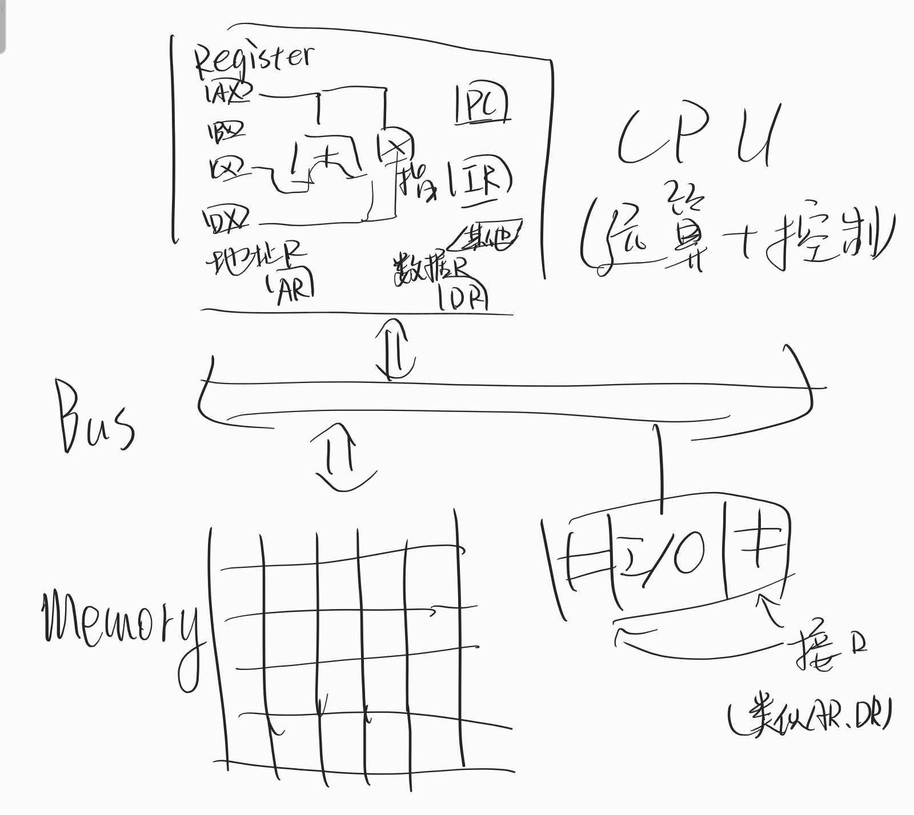

# 计算机原理作业：虚拟机

**tosaki**  
[在GitHub上查看](https://github.com/tosaki-up/assembly_VM)

## 流程图
 

## 基本设定
该程序命令均为大写字母，并假设输入的参数为变量代号(仅支持字母)或内存地址(仅支持十进制数字)，命令、变量之间可用空格或半角逗号隔开。  
对于布尔类型，值>0的为True，否则为False。  
该程序可在运行开始后对内存和外存进行虚拟化。为了方便调试起见，外部I/O暂时被编写为键盘/屏幕，故外存暂未实现。  
由于本人对汇编语言实在是不熟悉，故很多命令可能不符合汇编的表达形式，还请谅解。  
该程序支持输入空行或开头空格，但指令、数据之间的空格最多有一个。  
该程序实现了类似于高级语言goto的跳转，配合条件跳转可实现分支和循环。


## 语句说明
- LD,ST:从内存相应地址中读取/存入
- ADD,SUB,MUL,DIV:加减乘除四则运算
- JMP,JC:无条件/条件跳转
- AND,OR,NOT:布尔与/或运算
- MOV:复制值
- IN,OUT:外部输出输出

## 原理说明
该程序全部内容都在同目录assembly_vm.cpp中。  
该程序进行内存和外存的初始化后，先读入总共的语句量n，后读入n行语句。之后程序会逐行翻译语句(将字符串分离为指令和数据)，并按照相应的指令顺序处理(除非有跳转)。  
变量表、跳转标签表均使用数组手动实现(写完了这部分才想起来有个map可以用)。


## 样例
借此程序可实现很多功能，譬如该NOIp 2012 普及组的题目:
[P1075 质因数分解](https://www.luogu.com.cn/problem/P1075)  
此题可以考验该程序跳转、条件判断的实现。  
以下代码均可在同目录下找到。


#### 等效Python代码
```python
n=int(input())
flag=False
for i in range(int(n/2+1),1,-1):
    for j in range(2,i):
        if i*j==n:
            flag=True
            break
    if flag:break
print(i)
```

#### 自创代码
> 初始化:内存 0 1 1 2 2 0 外存空
```asm
INT N
IN N
INT I
INT J
INT RNGI
INT RNGJ
MOV RNGI N
INT TMP
LD TMP 0
ADD RNGI TMP
LD TMP 1
DIV RNGI TMP
INT TMP1
INT TMP2

MV I RNGI
istart:
    LD J 1
    jstart:
        MOV TMP I
        MUL TMP J
        MOV TMP2 N
        SUB TMP2 TMP
        SUB TMP N
        OR TMP TMP2
        NOT TMP TMP
        JC TMP endf
    forjend:
    LD TMP 0
    ADD J TMP
    MOV TMP I
    SUB TMP J
    JC TMP jstart
LD TMP 0
SUB I TMP
MOV TMP1 I
SUB TMP1 TMP
JC TMP1 istart
endf:
OUT I
```
依次输入：（开头的数据需要依次输入，之后的代码可复制粘贴）
```asm
3
0 1
1 2
2 0
0
40
INT N
IN N
INT I
INT J
INT RNGI
INT RNGJ
MOV RNGI N
INT TMP
LD TMP 0
ADD RNGI TMP
LD TMP 1
DIV RNGI TMP
INT TMP1
INT TMP2

MV I RNGI
istart:
    LD J 1
    jstart:
        MOV TMP I
        MUL TMP J
        MOV TMP2 N
        SUB TMP2 TMP
        SUB TMP N
        OR TMP TMP2
        NOT TMP TMP
        JC TMP endf
    forjend:
    LD TMP 0
    ADD J TMP
    MOV TMP I
    SUB TMP J
    JC TMP jstart
LD TMP 0
SUB I TMP
MOV TMP1 I
SUB TMP1 TMP
JC TMP1 istart
endf:
OUT I
35
```
> 输出：7  

若最后的数字输入77则输出11。  
故可认为该程序正常运行。